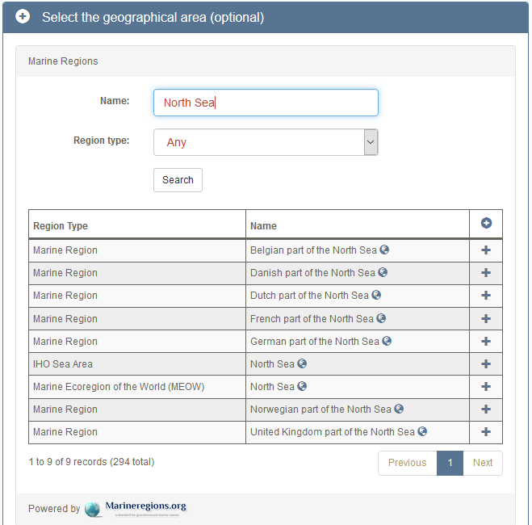

### 3.1 Data access in EMODnet Biology
#### 3.1.1. Download in EMODnet Biology webportal

We will download some EMODnet Biology species observations with the Download Toolbox:

  * Go to <http://www.emodnet-biology.eu/>
  * Navigate to Data Download -> the [Data Download Toolbox](http://www.emodnet-biology.eu/toolbox)
* Here you can select and download the data in two steps:
  + Select a Datasource, Geographical Area or time period (all optional), Click 'Next'
+ Select a Species trait, Taxonomic search, a measurement type (abundance/biomass) or Data Precision (all optional), Click 'Next'
* Now you have an overview of all your data, which you can download, view on a webmap, ...
* If you selected a large area, it can take a while before your map/download starts

Now, if we want for example the data of Lesser Black-backed Gull ([*Larus fuscus*](www.marinespecies.org/aphia.php?p=taxdetails&id=137142)) in the North Sea,
then we have to provide the **Geographical Area** and the **Taxonomic Search** in the toolbox to refine our results.

The Geographical area can be set by searching on 'North Sea'. This will give you a number of results from the [MarineRegions](http://marineregions.org) database.
<center></center>

  <br>

  You then can select for example the IHO Sea Area 'North Sea'.
You can also draw a rectangle on the small map to indicate your extent.

In the taxonomic search, fill in *Lesser Black-backed Gull*.
You see that two taxa appear, select the first one with AphiaID 137142.

Now you can download the data, view the data on the map or get the webservice url.
If you click 'download', you have to fill in your country and purpose and then click 'prepare download'.
For the 15000+ records in my selection, it took less than a minute to prepare the download (4 MB).

***

<br>


### 3.2 Data loading in R

Now I can load and visualize the data in R:

Prepare the R environment by loading the packages that we'll need:

```{r message=FALSE, warning=FALSE, error=FALSE, fig.align='center'}
library(data.table)
library(ggplot2)
library(sf)
library(dplyr)
```

Then load the downloaded file

```{r message=FALSE, warning=FALSE, error=FALSE, fig.align='center'}

# load downloaded file
fname <- 'data/20190208_Larus_fuscus_NZ_EMODnetBio.csv'
Larus_fuscus_NZ <- fread(fname,
                         header = TRUE,
                         sep = ',')
```

convert to a spatial object

```{r message=FALSE, warning=FALSE, error=FALSE, fig.align='center'}
# convert to sf object
Larus_fuscus_NZ_sf <- st_as_sf(Larus_fuscus_NZ,
                               coords = c("longitude", "latitude"),
                               crs = 4326)
```

### 3.2 Data visualization

Plotting:
A base plot:
```{r message=FALSE, warning=FALSE, error=FALSE, fig.align='center'}
# base plot
plot(st_geometry(Larus_fuscus_NZ_sf), axes = TRUE)
```

```{r message=FALSE, warning=FALSE, error=FALSE, fig.align='center'}
# Plot data in ggplot, color by month
if (utils::packageVersion("ggplot2") > "2.2.1"){
  ggplot() +
    geom_sf(data=Larus_fuscus_NZ_sf,
            aes(colour=monthcollected))
}
```

for faster performance in this exercise, we select only a part:
```{r message=FALSE, warning=FALSE, error=FALSE, fig.align='center'}
# interactive map, color by year
# for faster performance in this tutorial, we select only a part:
# long: 0-5°
# lat: 50-52°
selectbox <- st_polygon(list(rbind(c(0,50), c(0,52), c(5,52), c(5,50), c(0,50))))
selectbox <- st_sfc(selectbox, crs = 4326)

Larus_fuscus_sel <- Larus_fuscus_NZ_sf %>% 
                        filter(st_intersects(., selectbox, sparse = FALSE))
```

interactive map:
```{r message=FALSE, warning=FALSE, error=FALSE, fig.align='center'}

# you can create interactive maps with the mapview package:
# more info: https://github.com/r-spatial/mapview
library(mapview)
mapview(Larus_fuscus_NZ_sf,
        zcol = 'yearcollected',
        cex = 3, lwd = 0.5,
        legend = TRUE,
        viewer.suppress = FALSE)
```

### Exercise

Can you see a trend in Lesser Black-backed Gull observations in the North Sea over the years?
In which year there were the most observations?
